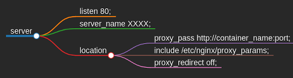

# Backend Developer

## Table of Content

1. [Overview](#overview)
2. [Project Structure](#proejct-structure)
    - 2.1. [Nginx Reverse Proxy](#nginx-reverse-proxy)
    - 2.2. [MongoDB](#mongodb)
    - 2.3. [API - FastAPI](#api-fastapi)
3. [Run the project](#run-the-project)    

### Overview

The journey of knowledge is an endless path, we never stop. More than two years ago (August, 2019), I started learn about software development, since then I keep my journey.

 

In my Master's, Solar Energy Engineering, I have the opportunity to develop software to simulate a photovoltaic energy system. I loved an experience, especially when I first meet the Python language, that blow my mind.

 

The proposal to my final project was the development in the Python language. My time was divided in learn about solar energy and software development.

 

How you know, Python is a general-purpose language, we can develop web applications, data processing, machine learning and so on.

 

I started with web development with Flask to serve the front-end with Jinja template and apis. Recently, I change my first choice to develop apis with the FastAPI, "a modern, fast (high-performance), web framework for building APIs with Python 3.6+ based on standard Python type hints".

 

This project is my first contribution in the devs community, I hope don't stop.

In my goals, I follow the back-end <a href="https://roadmap.sh/backend" target="_blank">back-end</a> roadmap.

In this project we can analyze how the basic structure of an Nginx proxy server, the MongoDB database and an API with a flow to register user, password recovery and login. The system design is strucutured in microservices, in this case the system have three services, three Docker Containers.

 

### Documentation

* [Python 3.8.10](https://docs.python.org/release/3.8.10/)
* [Nginx](http://nginx.org/en/docs/)
* [MongoDB](https://docs.mongodb.com/manual/)
* [FastAPI](https://fastapi.tiangolo.com)
* [Docker](https://docs.docker.com)

### Next steps

* Testing:
   - Integration;
   - Unit tsting;
   - Functional testing;
* CI/CD;
   - Github Actions.
* Logs;
* Web Sockets
* Keep learning. 

## Project Structure

### Nginx Reverse Proxy

The microservice reverse proxy is responsibility of the nginx container (called server). The docker container is made with an Ubuntu 18.04 image. I chose this image because of its compatibility with cerbot to manage the SSL certificates.

 

The basic structure to run the functionality Nginx:

* Directory sites-enabled to load the apps;
* mine.types;
* nginx.conf;
* proxy_params.

With Nginx we can redirect the clients requests to apropriete container.

The external link is made just by Nginx.

The structure tree is like:

    <kbd>
        
    </kbd>

##

Checkout the file in:

> ./server/sites-enabled/auth.conf

The image was built according to the Dockerfile:

> ./server/Dockerfile

### MongoDB

The database microservice is a MongoDB container, an amazing NoSQL database, flexible with excellent performance. I also love PostgreSQL, but for the purpose of this project, a CRUD system to register and login systenm, I believe that mongodb is a better choice.

 

### API - FastAPI

Like a said before, I started my studies in the web development world with Flask, a Python framework to build apis. I really liked, but the I think that FastAPI is more appropriate, the possibility of typing is amazing, and incredible documentation and performance. So, in the moment, my choice to make apis in Python lingauge is FastAPI.

To behave like expected, is necessary the .env file with environment variables.

* SECRETE_KEY;
* SERVER_NAME;
* MONGO_HOST - When the containers are in the same network is possible to use the container name to communicate between them;
* USERS_PASSWORD;
* MONGO_DB_URL;
* EMAIL_USER;
* EMAIL_PASS;
* MAIL_SERVER.

## Run the project

To run this project is necessary to install <a href="https://docs.docker.com/get-docker/" target="_blank">Docker</a> and <a href="https://docs.docker.com/compose/install/" target="_blank">Docker-compose</a> in your machine.

After you clone this project, cd backend-server and run "docker-compose up -d".

